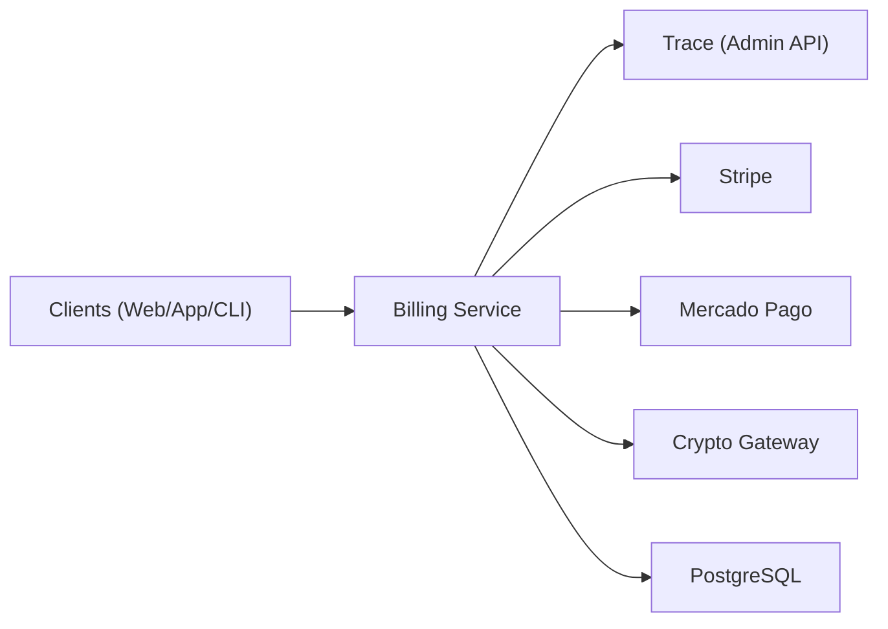

# Billing Service Architecture

## Components



## Data Model

### Core Tables

| Table | Purpose |
|-------|---------|
| `organizations` | Tenants with tier assignment |
| `subscriptions` | Active billing subscriptions |
| `invoices` | Billing records |
| `tier_quotas` | Feature/device limits per tier |
| `plans` | Plan definitions (price, interval) |
| `api_tokens` | Scoped API tokens per org |
| `usage_metrics` | Metered usage tracking |
| `webhook_events` | Idempotency store |
| `payment_attempts` | Dunning tracking |

### Tier Quotas

| Tier | Devices | Events/day | Retention | API Tokens | Alert Rules | Features |
|------|---------|-----------|-----------|-----------|-------------|----------|
| free | 5 | 1,000 | 30d | 1 | 0 | symbolication |
| hobbyist | 100 | 50,000 | 90d | 5 | 5 | + analytics export |
| team | 1,000 | 500,000 | 1y | 20 | 50 | + integrations, SSO, audit, on-call |
| enterprise | ∞ | ∞ | ∞ | ∞ | ∞ | + priority support, SLA, on-prem |

## Payment Flow

1. Client calls `POST /v1/subscriptions` with provider + plan_id
2. Billing creates checkout session (Stripe MP / Crypto)
3. Client completes payment in checkout UI
4. Provider sends webhook → Billing validates + idempotency check
5. Billing provisions features via Trace Admin API
6. Trace activates entitlements for the organization

## Webhook Processing

- **Idempotency**: Events deduplicated by `event_id` (in-memory + DB)
- **Stripe**: `Stripe-Signature` header verification
- **Mercado Pago**: `x-signature` HMAC-SHA256 verification
- **Crypto**: `x-cb-signature` / `x-nowpayments-signature` HMAC verification

## Proration

Mid-cycle plan changes calculate proration:

```
proration = (days_remaining / total_days) × (new_price - old_price)
```

## Dunning

Failed payments trigger automatic dunning:
1. Day 0: Payment fails → mark `past_due`
2. Day 1: Retry payment (first attempt)
3. Day 3: Retry payment (second attempt) + dunning email
4. Day 7: Retry payment (final attempt) + grace period email
5. Day 14: Subscription canceled → downgrade to free tier
